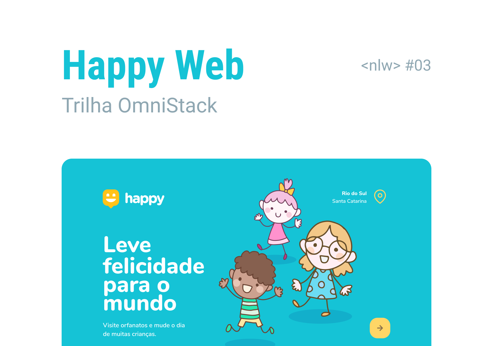

<h2 align="center">
    
</h2>
  

  

  

  	
  
	
  
  

  
   

<h2 align="center">
    
</h2>

## 📝 Conteúdo

<a href="#nwl">O que há na Next Level Week?</a>&nbsp;&nbsp;&nbsp;|&nbsp;&nbsp;&nbsp;
<a href="#about">Sobre</a>&nbsp;&nbsp;&nbsp;|&nbsp;&nbsp;&nbsp;
<a href="#additional">Funcionalidades Adicionais</a>&nbsp;&nbsp;&nbsp;|&nbsp;&nbsp;&nbsp;
<a href="#getting_started">Iniciando</a>&nbsp;&nbsp;&nbsp;|&nbsp;&nbsp;&nbsp;
<a href="#built_using">Tecnologias Utilizadas</a>&nbsp;&nbsp;&nbsp;|&nbsp;&nbsp;&nbsp;
<a href="#contribute">Como contribuir</a>&nbsp;&nbsp;&nbsp;|&nbsp;&nbsp;&nbsp;

## ℹ️ O que há na Next Level Week?

	
	
O NLW é uma semana prática com muito código, desafios, redes e um único objetivo: levá-lo ao próximo nível. Através do nosso método, você aprenderá novas ferramentas, aprenderá sobre novas tecnologias e descobrirá hacks que irão impulsionar sua carreira. Um evento online e totalmente gratuito que o ajudará a dar o próximo passo na sua evolução como desenvolvedor.

## 🧐 Sobre 

Happy é uma Aplicação feita durante a **NWL 2.0** oferecido pela [Rocketseat] :rocket:.  
A aplicação visa estabelecer um contato entre as pessoas que deseja visitar um orfanato e os orfanatos 
mais próximos de sua localização. Como a aplicação foi feita nos dias das crianças, o melhor presente
que uma criança pode ganhar é o seu tempo e sua atenção a ela.  

	<h2>Preview</h2>
	
    	

## ➕ Funcionalidades Adicionais 

- Styled-Components
- Dark theme
- Onboarding
- Unform
- Validação de dados
- Criação de usuário
- Autenticação de usuário
- Seed para usuário padrão

## 🏁 Iniciando 

Instruções de como acessar as rotas e instalação.

### ⚒ Instalando 

1.``git clone https://github.com/Gabrielpdev/Happy.git`` 

#### ⚙️ Iniciando com o Back-end

Entrando no backend    
2. ``cd Happy``  
3. ``cd server``  
4. Crie um arquivo ``.env`` baseado no ``.env.example`` e configure de acordo com a sua máquina.   
5. ``yarn typeorm migration:run``   
6. ``yarn seed:run``   
7. ``yarn dev``   

#### 💻 Iniciando com o Front-end

8. ``cd web``   
9. ``yarn start``   

#### 📱 Iniciando com o Mobile

10. Instalar o aplicativo Expo no seu celular   
12. ``cd mobile``   
13. ``yarn start``   
14. Escanear o QRCode disponibilizado na tela.   
15. App pronto para uso !   

## ⛏️ Tecnologias Utilizadas 

As seguintes ferramentas foram usadas na construção do projeto:
- 🔵 [TypeScript][typescript]
- 🟢 [Node Js][nodejs]
- ⚙ [TypeORM][typeorm]
- 🐘 [Postgres][postgres]
- ✅ [Yup][yup]
- ⚛️ [React][reactjs]
- ⚛️ [React Native][reactNative]
- 🔼 [Expo][expo]
- 🗺️ [MapView][expo-maps]
- 📷 [Expo Image Picker][image-picker]
- 💅 [Styled-components][styled-components]

## 🤔 Como contribuir 

- Faça um fork desse repositório;
- Cria uma branch com a sua feature: `git checkout -b minha-feature`;
- Faça commit das suas alterações: `git commit -m 'feat: Minha nova feature'`;
- Faça push para a sua branch: `git push origin minha-feature`.

Feito com ❤️ por Gabriel Pereira 👋🏽 [Entre em contato!](https://www.linkedin.com/in/gabriel-pereira-oliveira-78b1801ab/)

[expo]: https://expo.io/
[expo-maps]: https://docs.expo.io/versions/latest/sdk/map-view/
[image-picker]: https://docs.expo.io/versions/latest/sdk/imagepicker/
[image-picker]: https://docs.expo.io/versions/latest/sdk/imagepicker/
[handlebars]: https://handlebarsjs.com/
[postgres]: https://www.postgresql.org/
[typeorm]: https://typeorm.io/#/
[nodejs]: https://nodejs.org/en/
[redis]: https://redis.io/
[yup]: https://github.com/jquense/yup
[typescript]: https://www.typescriptlang.org/
[reactjs]: https://reactjs.org
[reactNative]: https://reactnative.dev/
[rs]: https://rocketseat.com.br
[Rocketseat]:https://github.com/Rocketseat
[styled-components]:https://styled-components.com/

